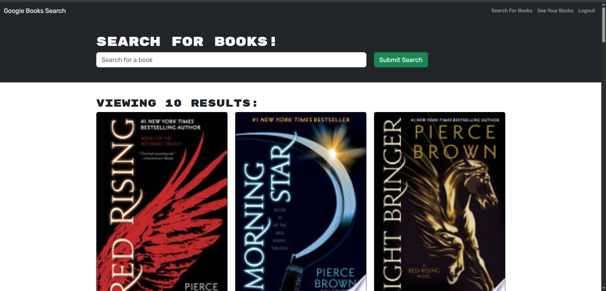

# book-search-engine

[](https://mit-license.org/)

## Description
        
A Google Books search engine application using GraphQL API built with Apollo Server, where users can search for books and save them to their collection. This app was built using the MERN stack with a React front end, MongoDB database, and Node.js/Express.js server. 


        
## Table of Contents

* [Installation](#installation)
* [Usage](#usage)
* [Questions](#questions)
* [License](#license)
        
## Installation
        
> To install dependecies
```
npm i
```
> To build the application
```
npm run build
```
> To run the application
```
npm start
```
        
## Usage
        
To use this application. Simply use the search bar to search any book, and the page will populate with the book you are looking for. To save books, sign in or sign up at the top right of the page. To view your saved books, go to the my books page, where you can also delete books.

See the [Deployed Application](https://book-search-engine-1xq1.onrender.com/)

## Questions

[My GitHUb profile](https://github.com/JamixB97)

For additional questions email me at bamesb@gmail.com 

## License
    
This project is licensed under the MIT License - see the [License](https://mit-license.org/) file for details.
